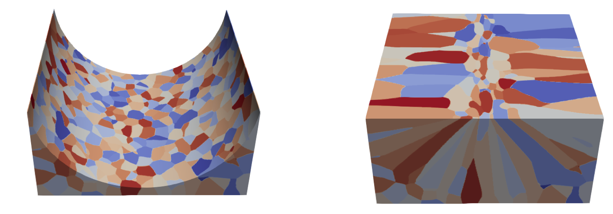

# cuPF
Phase field solvers written in C++, CUDA. Scaling: CUDA-aware MPI.   
The solvers model microstructure evolution of metals under various thermal conditions.  
Support: (1) 2D/3D grain-scale simulation (2) 2D dendrite-scale simulation  

## Cite

If you are using the codes in this repository, please cite the following paper
```
@article{qin2022dendrite,
  title={Dendrite-resolved, full-melt-pool phase-field simulations to reveal non-steady-state effects and to test an approximate model},
  author={Qin, Yigong and Bao, Yuanxun and DeWitt, Stephen and Radhakrishnan, Balasubramanian and Biros, George},
  journal={Computational Materials Science},
  volume={207},
  pages={111262},
  year={2022},
  publisher={Elsevier}
  url = {https://www.sciencedirect.com/science/article/pii/S0927025622000660}
}
```


## Build
The codes were deployed on TACC supercomputer systems. To run the codes on your system, in the Makefile, set/replace the following variables or paths:    
CUDA: `$(CXX)`, `$(CUDA_PATH)`   
HDF5: `$(HDF5_LIB)`, `$(HDF5_INC)`  
For python3: pip3 install -r requirements.txt 

Optional -- MPI  
MPI with CUDA-aware features such as MVAPICH2 should be installed and the following variables or paths should be set:    
In Makefile: `$(MPICXX)`, `$(MPI_INC)`  
Also remeber to set the `$(LD_PRELOAD)` path to include installed libmpi.so  

For example:
```sh
cd 3DgrainMPI
make
export LD_PRELOAD=/opt/apps/intel23/mvapich2-gdr/2.3.7/lib64/libmpi.so    # set/export environment variables for CUDA/MPI
```

## 3D grain simulation with MPI
Examples of running 3D grain-scale simulations for different geometries, refer to grains3D.py for all input options
### rectangular geometry
```sh
python3 grains3D.py --meltpool=line --seed=0         # random seed for the substrate microstructure
python3 grains3D.py --meltpool=line --boundary=110   # boundary condition for xyz axis. "1" for periodic, "0" for no-flux
python3 grains3D.py --meltpool=line --mpi=2          # use two GPUs with CUDA-aware MPI
python3 grains3D.py --meltpool=line --lineConfig     # use moving-domain technique to reduce the height 
python3 grains3D.py --meltpool=line --lineConfig --nucleation     # include nucleation in the simulation
```
set material/process/simulation parameters in line.py. If temperature gradients change over time, use lineTemporal.py. To visualize the output data, transform the h5 data to vtk data and use tools such as paraview:
```sh
python3 saveVTKdata.py --seed=0 --gpus=1 --subsample=4 --lxd=40 --rawdat_dir=../outputs/   # set gpus if using MPI, lxd is the domain width, rawdat_dir is the folder of h5 file
```


### cylindrical geometry
```sh
python3 grains3D.py --meltpool=cylinder --liquidStart --seed=0   # use --liquidStart; the initial condition is generated by random nucleation from pure liquid then clipped to the target initial geometry
```
set material/process/simulation parameters in cylinder.py


###  moving melt pool
```sh
python3 grains3D.py --meltpool=cone --liquidStart --seed=0   
```
set material/process/simulation parameters in cone.py


## 3D grain simulation; no MPI, simple rectangular geometry
```sh
cd 3Dgrain
make
./phase_field input_file -s SEED  
```

## 2D dendrite simulation  
```sh
# DNS simulation
cd 2DdendriteMPI/DNS
make
python3 thermal.py
./phase_field input_file thermal_folder
# line simulation
cd 2DdendriteMPI/DNS
make
python3 thermal.py
./phase_field input_file thermal_folder
```


https://user-images.githubusercontent.com/62076142/189384626-9093423b-6516-4eb5-9464-cf358a0a4ce4.mp4
     
## Performance/scaling
 


## Reference
```
[1] Blas Echebarria, Roger Folch, Alain Karma, and Mathis Plapp. Quantitative phase-field model of alloy solidification. Physical Review E, 70(6):061604, 2004.
[2] Pinomaa, T. et al. Process-Structure-Properties-Performance modeling for selective laser melting. Metals 9, 1138 (2019).
```
## Author
This software was primarily written by Yigong Qin who is advised by Prof. George Biros.
